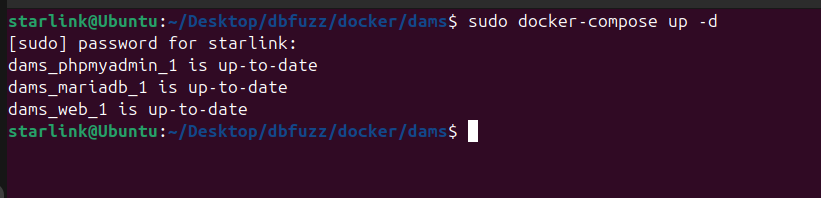
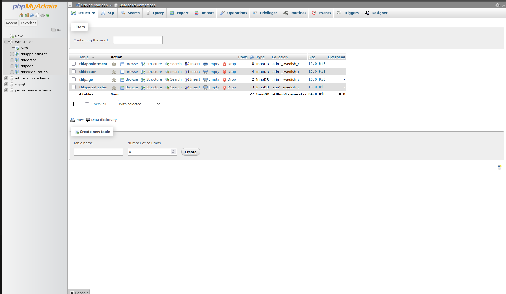
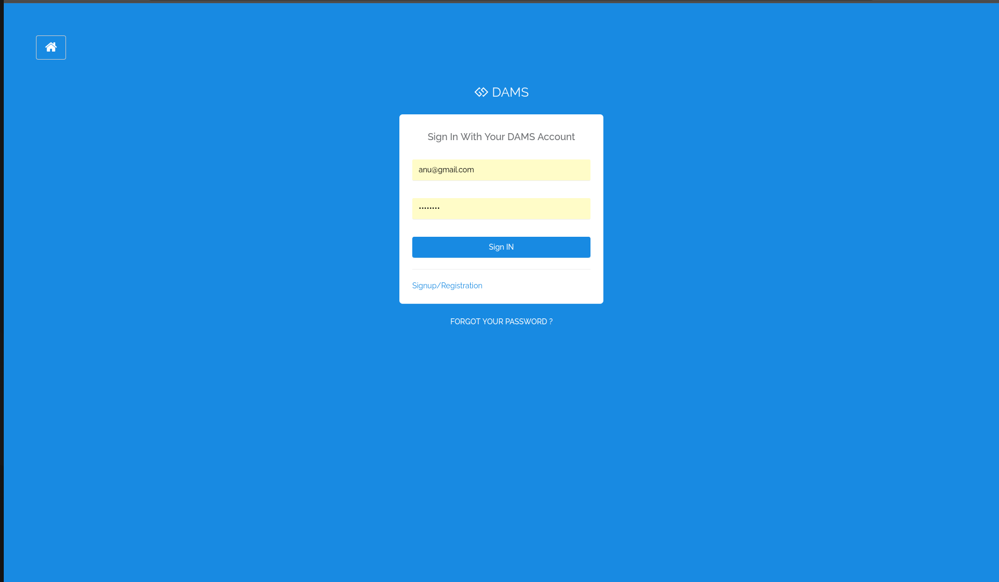
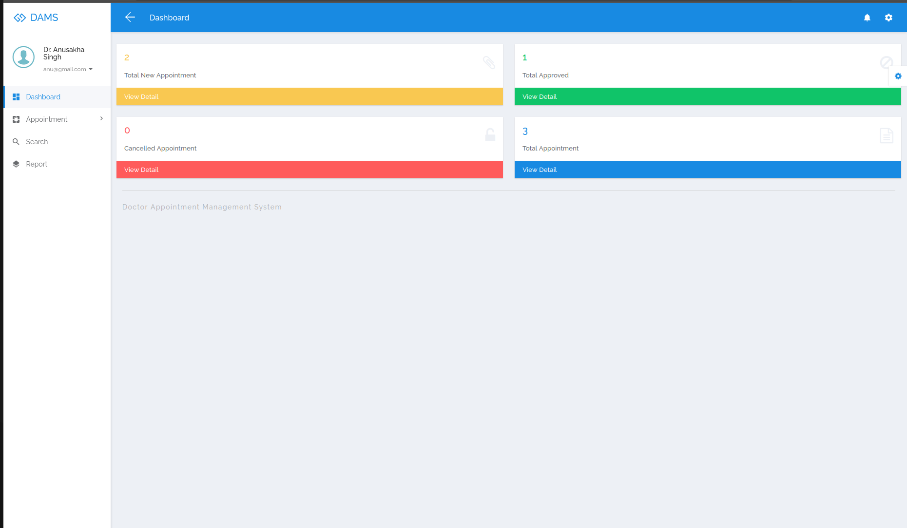
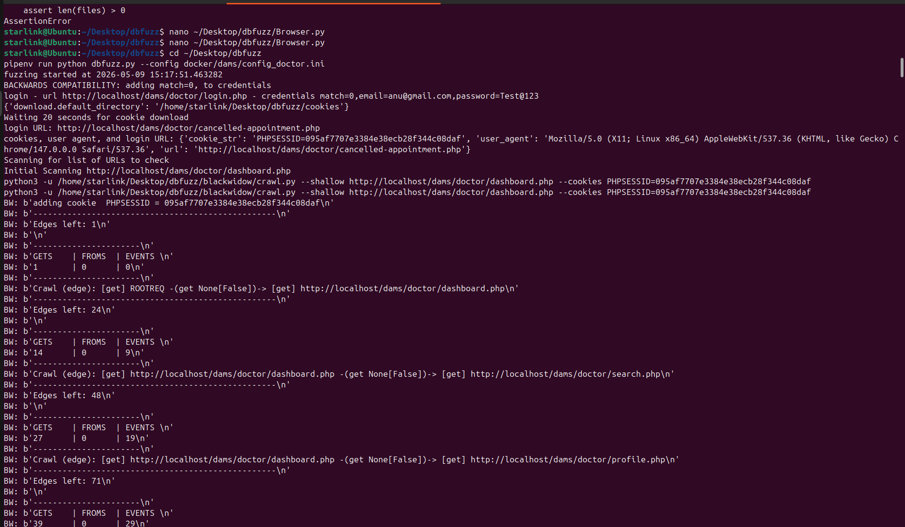
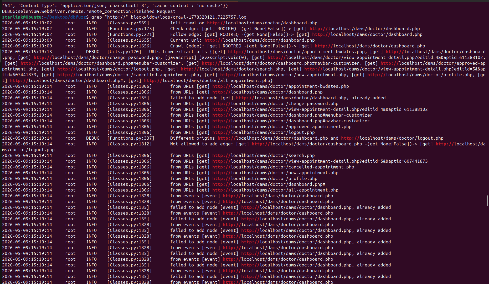
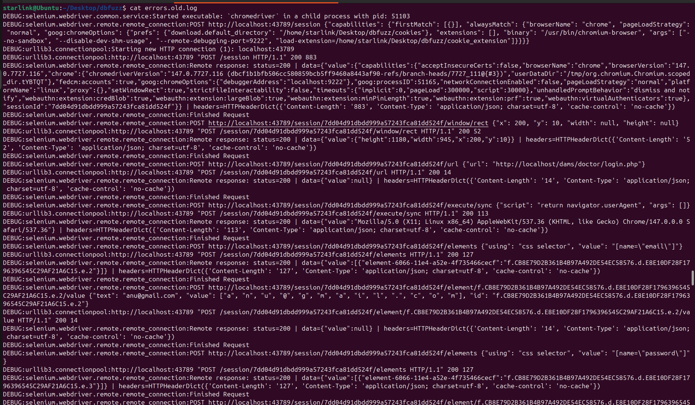

# DBFuzz Implementation on Doctor Appointment Management System (DAMS)

## Team Members
- Sandeep Khachariya (2023UCP1628)
- Dhiraj Chouhan (2023UCP1591)

---

## Project Overview

This project focuses on implementing **DBFuzz**, an automated fuzz testing framework on a vulnerable web application called **Doctor Appointment Management System (DAMS)**.

### Objective
- Deploy DAMS using Docker
- Configure database
- Automate login
- Handle sessions/cookies
- Crawl authenticated pages
- Discover endpoints
- Perform fuzz testing
- Detect vulnerabilities/errors

---

## What is DBFuzz?

DBFuzz is an automated web fuzz testing framework that:

- Automatically logs into web applications
- Extracts session cookies
- Crawls authenticated pages
- Identifies endpoints/routes
- Sends fuzz payloads
- Detects vulnerabilities and abnormal responses

### Vulnerabilities it helps detect:
- Stored XSS
- Broken authentication
- Input validation issues
- Hidden endpoints
- Session handling issues
- Error-based vulnerabilities

---

## Target Application

### Application URL
```bash
http://127.0.0.1/dams
```

### Login URL
```bash
http://127.0.0.1/dams/doctor/login.php
```

### Test Credentials
```bash
Email: anu@gmail.com
Password: Test@123
```

---

## Technologies Used

- Python
- Selenium
- Docker
- Docker Compose
- MariaDB
- Apache
- phpMyAdmin
- DBFuzz
- BlackWidow Crawler
- Chromium Browser

---

## Project Workflow

### Step 1: Clone DBFuzz
```bash
git clone <repository-url>
cd dbfuzz
```

### Step 2: Start DAMS Application
```bash
cd docker/dams
sudo docker-compose up -d
```

This starts:
- Web container
- Database container
- phpMyAdmin container

---

### Step 3: Database Setup

- Open phpMyAdmin
- Create database: `damsmsdb`
- Import SQL file: `damsmsdb.sql`

---

### Step 4: Access Application

```bash
http://127.0.0.1/dams
```

Login using:

- Email: `anu@gmail.com`
- Password: `Test@123`

---

## Running DBFuzz

Main command used:

```bash
pipenv run python dbfuzz.py --config docker/dams/config_doctor.ini
```

This performs:

- Automatic login
- Cookie extraction
- Session handling
- Crawling
- Endpoint discovery
- Fuzz testing

---

## Problems Faced During Implementation

### 1. Docker Compose Issues
**Problem:** Containers failed to start  

**Fix:** Corrected Docker configuration and rebuilt containers.

---

### 2. Outdated Debian Repository Errors
**Problem:** Package installation failed  

**Fix:** Updated repository sources and reinstalled dependencies.

---

### 3. MariaDB Issues
**Problem:** Database connection failed  

**Fix:** Reconfigured MariaDB and imported SQL manually.

---

### 4. mysqldump Path Error
**Problem:**
```bash
FileNotFoundError: /opt/homebrew/bin/mysqldump
```

**Fix:** Installed MySQL client and corrected path.

---

### 5. Selenium Chrome Driver Error
**Problem:**
```bash
DevToolsActivePort file doesn't exist
```

**Fix:**
- Installed Chromium
- Installed compatible ChromeDriver
- Added proper browser flags

---

### 6. Cookie Extension Failure
**Problem:**
Old DBFuzz extension failed due to unsupported manifest version.

**Fix:**
Modified `Browser.py` and removed dependency on old extension.

---

### 7. Cookie File Assertion Error
**Problem:**
```bash
assert len(files) > 0
```

**Fix:** Implemented direct Selenium cookie extraction.

---

## Novel Work Done

### Direct Cookie Extraction
Removed outdated cookie extension dependency.

Instead of downloading `cookie.txt`, cookies were directly extracted from Selenium.

### Browser Compatibility Fix
Modified DBFuzz to work with latest Chromium and ChromeDriver.

### Docker Fixes
Fixed deployment issues in original DAMS setup.

### Manual Debugging
Resolved multiple runtime failures.

### Better Automation
Made the project fully reproducible for evaluation.

---

## Results Generated

DBFuzz successfully generated:

- Crawl logs
- Endpoint discovery logs
- Error logs

Example files:

```bash
blackwidow/logs/crawl-1778320121.7225757.log
errors.log
```

---


# Screenshots

## Docker Deployment


## Database Setup


## Login Page


## Dashboard


## DBFuzz Running


## Crawl Logs


## Error Logs



---
## Project Structure

```bash
dbfuzz-dams-project/
│
├── code/
├── report/
├── presentation/
├── screenshots/
├── results/
└── README.md
```

---

## Conclusion

Successfully implemented DBFuzz on DAMS and improved compatibility by fixing multiple real-world issues.

### Skills Demonstrated
- Web security testing
- Automated fuzzing
- Authentication testing
- Vulnerability detection
- Debugging
- Novel implementation improvements
